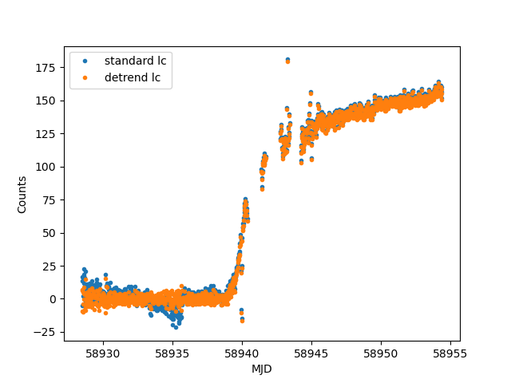

With this package that builds on lightkurve, you can reduce TESS data while preserving transient signals. You can supply a TPF or give coordinates and sector to construct a TPF with TESScut. The background subtraction accounts for the smooth background and
detector straps. Alongisde background subtraction TESSreduce also aligns images, performs difference imaging, and can even detect transient events! 

An additional component that is in development is calibration of TESS photometry, and reliably link muti-sector light curves.

TESSreduce can be installed through pip:

`pip install git+https://github.com/CheerfulUser/TESSreduce.git`

Example reduction for SN 2020fqv:
```
import tessreduce as tr
ra = 189.1385817
dec = 11.2316535
tess = tr.tessreduce(ra=ra,dec=dec)
tess.reduce()
# If you want to remove residual background trends from a bright as best as possible
detrend = tess.detrend_transient()
```


# Flux calibration

TESSreduce can calibrate TESS counts to physical flux, or AB magnitudes, by using PS1 data. If your field is dec > -30 and you want a flux calibrated light curve then use:
```
tess.to_flux()
```
**OR**
```
tess.to_mag()
```
Several options are available for flux and are interchangeable, however, mag is currently not reversible. To easily plot the resulting light curve:
```
tess.plotter()
```


There are a lot of other functions burried in TESSreduce which currently aren't well documented, so for more information contact me at: rridden@stsci.edu
